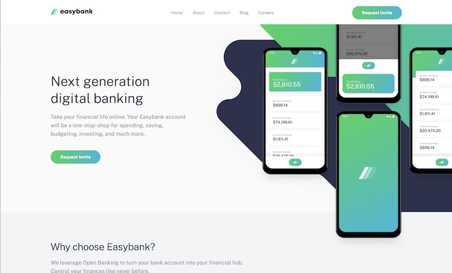

# Frontend Mentor - Easybank landing page solution

This is a solution to the [Easybank landing page challenge on Frontend Mentor](https://www.frontendmentor.io/challenges/easybank-landing-page-WaUhkoDN). Frontend Mentor challenges help you improve your coding skills by building realistic projects. 

## Table of contents

- [Overview](#overview)
  - [The challenge](#the-challenge)
  - [Screenshot](#screenshot)
  - [Links](#links)
- [My process](#my-process)
  - [Built with](#built-with)
  - [What I learned](#what-i-learned)
  - [Useful resources](#useful-resources)
- [Author](#author)

## Overview

### The challenge

Users should be able to:

- View the optimal layout for the site depending on their device's screen size
- See hover states for all interactive elements on the page

### Screenshot

### Links

<!-- - Solution URL: [Add solution URL here](https://your-solution-url.com) -->
- Live Site URL: [Easybank Landing Page](https://easybank-landing-page-matthiassmith.vercel.app)

## My process

### Built with

- Semantic HTML5 markup
- CSS Grid
- Mobile-first workflow
- [React](https://reactjs.org/) - JS library
- [Next.js](https://nextjs.org/) - React framework
- [Tailwind](https://tailwindcss.com/) - For styles
- [styled-jsx](https://github.com/vercel/styled-jsx) - For other styles

### What I learned

For this landing page, the challenge for myself was to do it fast. To keep my process quick, I decided to continue using NextJS and TailwindCSS mixed with some basic styled-jsx again.

For me, the performance for static site generation (SSG) and development speed which NextJS makes possible, makes using it a no-brainer. And even though this is only the second project I've used TailwindCSS for, it feels almost natural to me. It's so simple to use and their documentation is so quick and easy to search, that I know I'm only seconds away from finding and implementing anything I don't know how to do.

## Author

- Website - [Matthias Smith](https://portfolio-matthiassmith.vercel.app)
- Frontend Mentor - [@matthiassmith](https://www.frontendmentor.io/profile/matthiassmith)
- Twitter - [@matthiasdev](https://www.twitter.com/matthiasdev)

